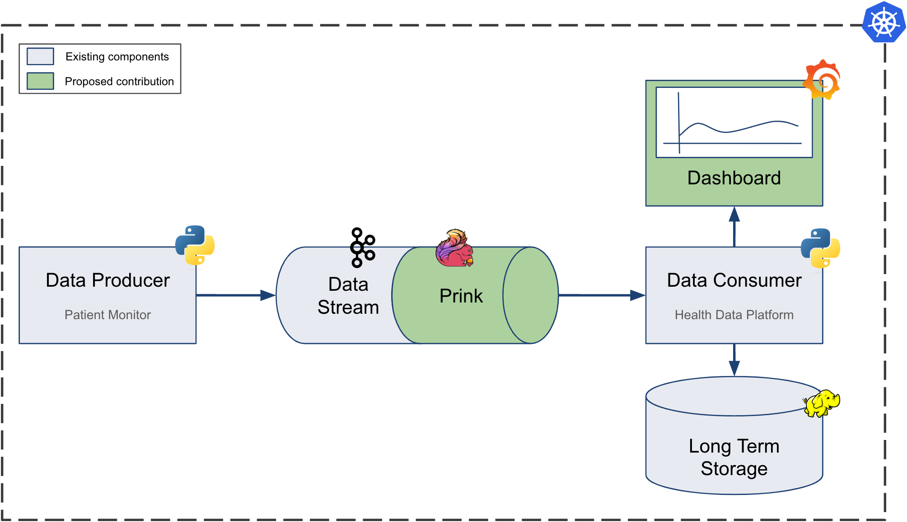
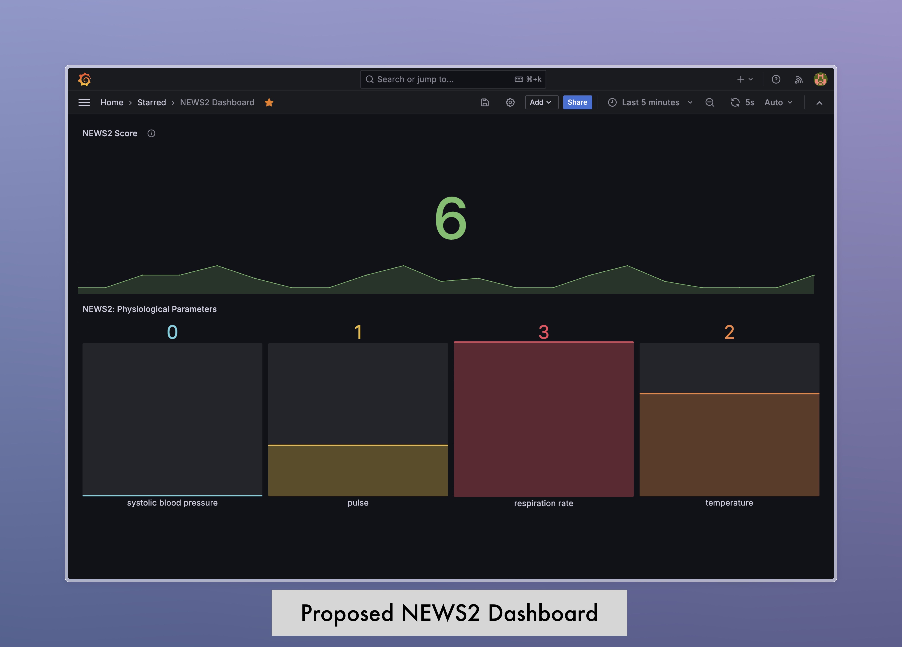

# anotherdemoapplication



This is a demo application for a Master's thesis project.
### Fundamental ideas:
- k8s deployment
- microservices
- streaming data
- in transit anonymization

### Roadmap:
- [x] Set up Repo
- [x] load generator service
- [x] Kafka topic
- [x] consumer service
- [x] Flink/Prink job
- [x] graphana dashboard
- [ ] HDFS long term storage

### Deployment:

#### Prerequisites:
- Docker
- Docker-compose

#### Build & run the docker images:
```bash
docker-compose up --build
```

#### Prometheus:


- Prometheus: [Dashboard](http://localhost:9090/graph?g0.expr=kafka_consumer_messages_total&g0.tab=0&g0.display_mode=lines&g0.show_exemplars=0&g0.range_input=1h)
- dashboard json reference located at ```prometheus/NEWS2...```

#### Grafana:
- Grafana available at http://localhost:3000
