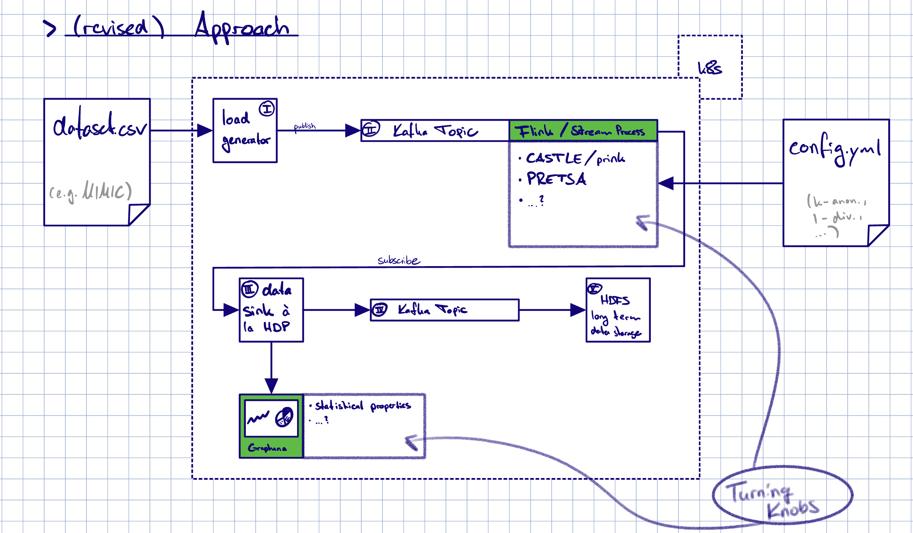

# anotherdemoapplication



This is a demo application for a Master's thesis project.
### Fundamental ideas:
- k8s deployment
- microservices
- streaming data
- in transit anonymization

### Roadmap:
- [x] Set up Repo
- [ ] load generator service
- [ ] Kafka topic A
- [ ] data sink service
- [ ] graphana dashboard
- [ ] Kafka topic B
- [ ] HDFS long term storage

### How to run:

Build the docker images:
```bash
docker-compose build
```

Run the services:
```bash
docker-compose up
```

Access the services:
- Kafka: Use kafka:9092 within Docker containers.
- Grafana: http://localhost:3000
- Flink Web UI: http://localhost:8081
- HDFS Namenode UI: http://localhost:9870
