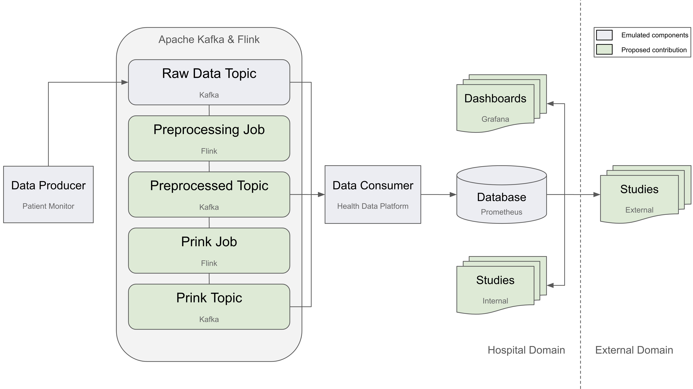
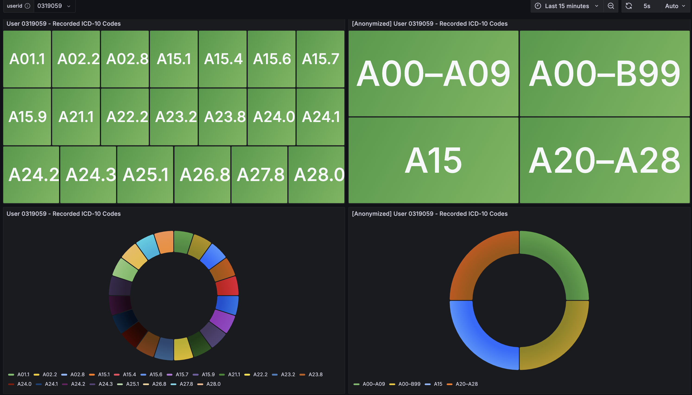

# anotherdemoapplication



This is a demo application for a Master's thesis project.
### Fundamental ideas:
- dockerized microservices
- streaming medical data
- in transit anonymization using CASTLE/prink

### Roadmap:
- [x] Set up Repo
- [x] load generator service
- [x] Kafka topic
- [x] consumer service
- [x] Flink/Prink job
- [x] graphana dashboard
- [ ] HDFS long term storage

### Deployment:

#### Prerequisites:
- Docker
- Docker-compose

#### Build & run the docker images:
```bash
docker compose up --build
```

Then visit:

- http://localhost:8081/#/overview
- http://localhost:3000/login
- http://localhost:9090/query

#### Grafana:
- Grafana available at http://localhost:3000
- Dashboard json reference located at ```grafana/NEWS2 Dashboard...json```

##### Dashboard Views





